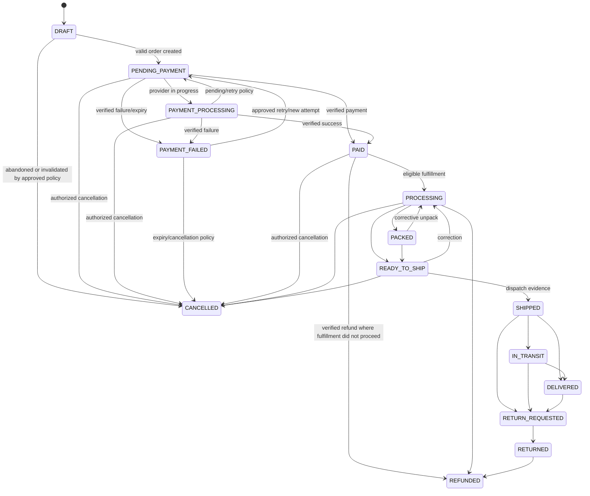

# PENA AMEEN Order Architecture

**Phase:** 3 — Technical Architecture

**Status:** PROPOSED order state architecture. It refines the Phase 1 conceptual state model into a technical state machine while retaining separate payment, fulfillment, shipment, and tracking domains. Provider mappings and business policies remain unknown where noted.

## 1. State-model principle

An order must not use one ambiguous status to represent payment, packing, shipping, and delivery. The architecture maintains:

- **Order workflow state** — commercial/operational progress;
- **Payment state** — attempt and verified financial status;
- **Fulfillment state** — readiness/packing/allocation;
- **Shipment state** — provider-neutral shipment/AWB/label/dispatch lifecycle;
- **Tracking state** — normalized external delivery observations;
- **Return/refund state** — conditional post-purchase workflow.

A staff/customer display may derive a simple status from these domains, but the underlying state history remains separate and auditable.

## 2. Proposed order state machine

| Order state | Entry conditions | Allowed transitions | Forbidden transitions | Primary actor | Side effects | Notification/audit |
|---|---|---|---|---|---|---|
| `DRAFT` | Checkout intent exists but no valid order commitment yet | `PENDING_PAYMENT`, `CANCELLED` | `PAID`, `SHIPPED`, `DELIVERED` | System/customer | Validate cart and checkout context only; no unapproved stock/payment claim | Audit only if meaningful; no customer order confirmation by default |
| `PENDING_PAYMENT` | Valid order snapshot exists and payment is required/not verified | `PAYMENT_PROCESSING`, `PAID`, `PAYMENT_FAILED`, `CANCELLED` | `PACKED`, `SHIPPED`, `DELIVERED` unless approved payment policy says otherwise | System/customer/provider event | Apply approved reservation policy; create payment attempt/outbox | Order created/pending notification where approved; audit transition |
| `PAYMENT_PROCESSING` | Provider/process reports in-progress status | `PAID`, `PAYMENT_FAILED`, `PENDING_PAYMENT`, `CANCELLED` | Fulfillment/shipping states | Provider event/system | Reconcile attempt; no fulfillment release | Pending/review notification only when approved; audit event |
| `PAID` | Verified payment evidence maps to paid | `PROCESSING`, `CANCELLED`, `REFUNDED` under approved policy | `PAYMENT_FAILED`; direct `SHIPPED` without fulfillment progression | Verified provider event or approved finance action | Confirm payment, create fulfillment work/outbox | Payment success notification; audit source/evidence |
| `PAYMENT_FAILED` | Verified failure/expiry/cancellation event maps to failure | `PENDING_PAYMENT` only if approved retry/new attempt; `CANCELLED` | `PAID` without a new verified attempt; fulfillment/shipping | Provider event/system | Release approved reservation if policy; create recovery work | Failure/expiry/cancel guidance; audit |
| `CANCELLED` | Authorized cancellation or approved expiry policy | `REFUNDED` only when payment/refund requires it | `PAID`, `PROCESSING`, shipment progress except documented corrective workflow | Customer/staff/system policy | Release reservation; cancel eligible shipment/payment intent; outbox | Cancellation notification; reason/audit mandatory |
| `PROCESSING` | Paid order passes operational eligibility checks | `PACKED`, `READY_TO_SHIP`, `CANCELLED`, `REFUNDED` under policy | `PAYMENT_FAILED`; `DELIVERED` | Staff/system | Allocate fulfillment work | Processing notification optional; audit staff/system action |
| `PACKED` | Staff confirms order packaging under SOP | `READY_TO_SHIP`, `PROCESSING`, `CANCELLED` under policy | `DELIVERED`; paid reversal without exception flow | Fulfillment staff | Package data/weight review; shipment readiness | Audit; customer display optional |
| `READY_TO_SHIP` | Shipment-ready conditions met | `SHIPPED`, `CANCELLED`, `PROCESSING` | `DELIVERED` without shipment/tracking evidence | Fulfillment staff/system | Create/select shipment, AWB/label if available | Audit; shipment-created/AWB notification as approved |
| `SHIPPED` | Approved dispatch/handoff event is recorded | `IN_TRANSIT`, `DELIVERED`, `RETURN_REQUESTED`, exception/manual-review state | `PAYMENT_FAILED`; `PACKED` without corrective reversal | Staff/provider tracking event | Dispatch record, tracking outbox | Shipped notification; audit evidence |
| `IN_TRANSIT` | Trusted carrier/provider tracking indicates movement | `DELIVERED`, `RETURN_REQUESTED`, exception/manual-review state | `PACKED`, `PENDING_PAYMENT` | Provider tracking event/system | Normalize tracking event | Tracking update optional; audit source event |
| `DELIVERED` | Trusted delivery evidence maps to delivered | `RETURN_REQUESTED` if policy permits; terminal otherwise | Revert to earlier normal state without documented correction | Provider tracking event/staff exception resolution | Close fulfillment readiness; post-purchase support context | Delivered notification optional; audit evidence |
| `RETURN_REQUESTED` | Approved customer/staff return request exists | `RETURNED`, `CANCELLED` only if rejected/withdrawn under policy | Direct `REFUNDED` without approved return/refund policy | Customer/support/staff | Create return workflow record | Return acknowledgment as approved; audit reason |
| `RETURNED` | Returned goods/return outcome verified under SOP | `REFUNDED`, terminal resolved state | `SHIPPED` as normal path | Staff/operations | Inspection/restock decision through inventory policy | Audit; customer update as approved |
| `REFUNDED` | Refund completion verified or approved terminal refund policy state | Terminal except correction/dispute policy | Fulfillment/shipping forward progression | Provider event/finance staff | Record refund/reconciliation; release/restock only per policy | Refund notification; audit amount/evidence |

`RETURN_REQUESTED`, `RETURNED`, and `REFUNDED` are included because the PRD requires cancellation/refund/return evaluation. Their exact customer policy, authorization, partial refund behavior, and provider mapping remain `CLIENT DECISION REQUIRED`.

## 3. State diagram

## 4. Separate payment, fulfillment, shipment, and tracking state

| Domain | Minimum technical states | Authoritative source |
|---|---|---|
| Payment | Not started; initiating; pending; requires review; verified paid; failed; expired; cancelled; refund requested/processing/refunded | Verified provider adapter event plus approved finance action |
| Fulfillment | Not eligible; eligible; processing; packed; ready; held/exception | Order/operations service and authorized staff |
| Shipment | Not created; requested; created; AWB assigned; label available; dispatched; cancelled; return in progress | Shipping service/provider adapter plus staff fallback |
| Tracking | Not available; tracking ID available; carrier status; in transit; delivered; exception; temporarily unavailable | Normalized provider tracking event or approved staff update |

The order state is derived/transitioned only through allowed policy, not directly edited as a free text field.

## 5. Idempotency and duplicate webhook handling

### Mandatory controls

- Each order creation request has a scoped idempotency key.
- Each payment attempt has an internal stable identifier and provider external reference.
- Each payment webhook receipt is deduplicated by provider event ID and normalized payload/reference checks.
- Replayed or delayed events cannot regress a final paid/refunded state without a documented reconciliation exception.
- Shipment creation uses a fulfillment/shipment idempotency key; retry must not create a second AWB/label silently.
- Tracking events preserve history while suppressing duplicate state/notification effects.
- Notifications derive from committed state/outbox records, not directly from duplicated webhook deliveries.

### Unmatched/conflicting events

An event with an unknown order/payment/shipment reference, invalid signature, inconsistent amount/currency/status, or impossible transition enters manual review/quarantine. It does not force an order state change.

## 6. Transition authorization

| Actor | Permitted transition class | Restriction |
|---|---|---|
| Customer | Initiate checkout/payment; request cancellation/return only if policy permits | Cannot mark paid, pack, ship, refund, or alter tracking |
| System | Draft/pending/retry/expiry transitions under approved policy | Cannot invent expiry/reservation/refund rules |
| Payment provider adapter | Payment status events | Only after signature/idempotency/reference validation |
| Finance/order staff | Approved review/cancel/refund actions | Final authority and thresholds are client decisions |
| Fulfillment staff | Processing/packed/ready/shipped actions | Must satisfy payment/order/SOP eligibility and audit |
| Shipping provider adapter | Shipment/tracking transitions | Only after provider validation and allowed mapping |
| Support staff | Request/record approved support actions | Cannot bypass finance/fulfillment authority |

## 7. Side-effect architecture

A state transition may create durable outbox intents for:

- transactional notification;
- inventory reservation/release/allocation/reconciliation;
- payment or shipping reconciliation;
- shipment/label/tracking work;
- search/analytics events where appropriate;
- admin exception/dashboard updates;
- audit records.

Side effects are idempotent and processed independently. A notification or analytics failure cannot roll back a verified payment/order transition; a provider failure cannot be reported as a completed order state.

## 8. Policy-dependent states

The following cannot be finalized without client/provider/SOP confirmation:

- whether `PENDING_PAYMENT` reserves inventory, for how long, and what expiry does;
- manual/offline/COD payment flows;
- cancellation timing and fee policy;
- packing/ready-to-ship customer visibility;
- automatic versus manual shipment creation;
- definition of dispatch/delivery evidence;
- returns, restock, replacement, partial refund, settlement, dispute, and chargeback workflows;
- notification channel/template timing;
- staff approval and override authority.

## 9. Audit requirements

Every transition records prior state, new state, actor class/ID, trigger/source, reason where applicable, correlation ID, timestamp, related payment/shipment references, and safe evidence summary. Historical order state migration, if approved, must preserve source status/mapping provenance rather than pretending source status equals target status.
