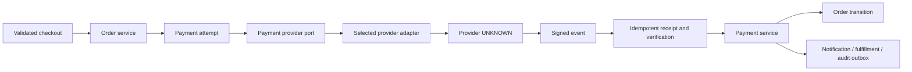

# PENA AMEEN Payment Architecture

**Phase:** 3 — Technical Architecture

**Status:** Provider-agnostic architecture with provider confirmations by implementation: **Casaku QRIS (primary, dynamic — nominal follows order total)** and **Midtrans Snap (backup)** (D011, D017). Refund policy, settlement behavior, and full status mapping remain `UNKNOWN`/`CLIENT DECISION REQUIRED`. Credentials live in environment variables/admin settings (masked, encrypted at rest); no provider secret is committed. Live Casaku calls currently return 403 until the license subscription is active (see D017).

## 1. Payment architecture principle

The application owns the order, payment-attempt, audit, and state-transition model. A provider adapter translates a selected provider contract into that provider-neutral model.

```text
Application service
→ Payment Provider Port
→ Provider Adapter
→ Payment Provider (UNKNOWN until selected)
```

The customer browser return is never sufficient payment proof. Verified provider events and approved reconciliation rules are authoritative for paid/refund transitions.

## 2. Provider-neutral port

| Capability | Provider-port responsibility | Application-owned responsibility |
|---|---|---|
| Availability/methods | Return configured eligible methods/capabilities | Decide which client-approved methods are offered for an order |
| Initiation | Create/obtain provider payment instruction/reference | Create idempotent PaymentAttempt tied to Order and safe customer response |
| Status lookup | Retrieve provider status if supported | Normalize/map status and reconcile against order/payment state |
| Webhook verification | Verify signature/timestamp/schema/provider event | Receive, deduplicate, audit, transition state through policy |
| Expiration/cancellation | Report provider status/action if supported | Apply approved order/reservation/customer-message policy |
| Refund | Initiate/observe supported refund operation | Enforce authority/policy, record amount/status/audit/reconciliation |
| Settlement/reconciliation | Provide provider references/reports where supported | Compare expected/payment state and raise exception/manual review |

The port API shape is conceptual. It is not an interface file or SDK contract.

## 3. Payment data flow



## 4. Payment attempt lifecycle

| Payment attempt state | Entry | Allowed result | Architecture behavior |
|---|---|---|---|
| Created | Order/payment initiation intent is valid | Initiating or cancelled | Persist idempotency/context before provider call |
| Initiating | Adapter call starts | Pending, failed, requires review | Do not assume provider request succeeded if network response is uncertain |
| Pending | Provider/process awaits customer/verification | Paid, failed, expired, cancelled, requires review | Return truthful pending state; schedule reconciliation only under approved policy |
| Paid/verified | Trusted provider event/status matches expected context | Terminal or refund workflow | Transition payment/order through service transaction; queue fulfillment/notification |
| Failed | Trusted failure event/status | Retry/new attempt/cancel per policy | Never mark order paid; release reservation only by approved policy |
| Expired | Trusted expiry event/status | New attempt/cancel per policy | Keep historical attempt; do not destroy order audit |
| Cancelled | Provider/customer/system cancellation confirmed | New attempt/cancel order per policy | Record source/reason; prevent duplicate use |
| Requires review | Mismatch, delayed/conflicting/unmatched event | Manual resolution | Quarantine/alert; do not force transition |
| Refund requested/processing/refunded | Authorized refund workflow | Verified completion/failure | Record amount/references; update order only through policy |

## 5. Webhook and reconciliation architecture

### Webhook processing

1. Provider adapter identifies configuration only after provider selection.
2. Webhook ingress applies size/rate/transport controls.
3. Adapter verifies signature, replay/timestamp rule where supported, event schema, and configured account context.
4. Store a minimal safe receipt with provider event ID/hash and correlation information.
5. Deduplicate/replay safely.
6. Locate payment attempt/order using trusted reference mapping.
7. Validate expected amount/currency/method/order relationship according to approved provider/business policy.
8. Normalize provider event into provider-neutral payment event.
9. Apply allowed idempotent transition and create audit/outbox records.
10. Quarantine exceptions for finance/admin review.

### Reconciliation

Reconciliation is a separate operational process for pending, delayed, mismatched, or settlement-related records. It must not be replaced by a customer’s screenshot, browser redirect, or a generic status edit. Settlement timing/fees/report availability are unknown and require finance/provider decisions.

## 6. Idempotency and duplicate safety

| Risk | Required control |
|---|---|
| Customer double-submits checkout | Reuse scoped order/payment idempotency key; return same pending/known attempt when valid. |
| Network timeout after provider request | Persist initiation state/reference and reconcile before retry; do not blindly create another charge. |
| Duplicate webhook | Provider event ID/hash receipt; process transition/notification once. |
| Out-of-order webhook | State machine allows only valid forward/corrective transitions; manual review on conflict. |
| Provider callback and status poll both arrive | Normalize to same attempt/event state and deduplicate side effects. |
| Refund retry | Idempotent refund request key and amount/reference validation. |
| Staff repeated action | Capability/audit/idempotency command boundary. |

## 7. Refund architecture

The data model supports refund records with amount, currency, payment reference, status, actor, reason, timestamps, and provider references. This supports a future full or partial refund model without committing to either workflow.

**CLIENT DECISION REQUIRED:** refund eligibility, authority, partial refund policy, return relationship, settlement timing, customer notification, accounting behavior, and provider support. A partial refund cannot be assumed simply because the architecture can represent an amount.

## 8. Security boundaries

- Never store raw card/bank credentials or provider secrets in order/payment records, client code, logs, analytics, or audit text.
- Keep provider secrets and signature validation server-side.
- Restrict payment/reconciliation/refund data/action to approved staff capabilities.
- Redact payment references appropriately in customer/admin views/logs.
- Authenticate webhooks independently of customer/staff sessions.
- Record audit context for payment state/refund/manual-review actions.
- Do not claim PCI compliance; responsibility/scope remains unknown until provider and compliance requirements are confirmed.

## 9. Manual fallback

Manual review is permitted for unmatched, ambiguous, delayed, or provider-outage cases only through approved finance/order operations. It must record evidence/source/reason/audit, not bypass the payment state machine. Manual/offline payment methods themselves are out of scope unless client-confirmed.

## 10. Critical decisions and blockers

Payment implementation remains blocked by provider/account owner, launch methods, event/webhook mappings, sandbox/test access, settlement/reconciliation, expiration/cancellation, refund policy, finance authority, legal policy, and order/fulfillment SOP. The architecture is complete as an abstraction; adapter implementation is intentionally not ready.
