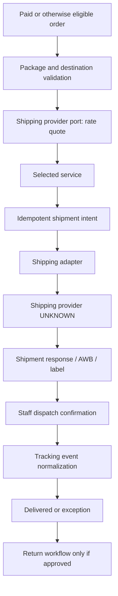

# PENA AMEEN Shipping Architecture

**Phase:** 3 — Technical Architecture

**Status:** Provider-agnostic architecture. Shipping provider/aggregator, couriers, origin(s), rate rules, package rules, AWB/label behavior, tracking contract, cancellation/return workflow, and operating SOP are `UNKNOWN` or `CLIENT DECISION REQUIRED`. No provider is selected or implemented.

## 1. Shipping architecture principle

The application owns checkout shipping intent, selected service context, shipment records, audit, tracking normalization, and customer/order state. A provider adapter translates an approved carrier/aggregator contract.

```text
Application service
→ Shipping Provider Port
→ Provider Adapter
→ Shipping Provider / Aggregator (UNKNOWN until selected)
```

## 2. Provider-neutral shipping port

| Capability | Provider-port responsibility | Application-owned responsibility |
|---|---|---|
| Destination validation/coverage | Report provider-supported destination/service constraints if available | Validate approved destination data and present safe recovery state |
| Rate quote | Return eligible courier/service/cost/expiry data | Validate order/package context; select/persist approved option |
| Shipment creation | Create provider shipment/reference | Create idempotent shipment intent and map response to provider-neutral state |
| AWB/resi | Return tracking identifier if/when available | Store validated identifier against shipment/order |
| Label | Return label availability/reference if supported | Authorize/retrieve/print workflow and audit |
| Tracking | Return or send tracking updates | Normalize events/history/customer-safe status |
| Cancellation | Cancel provider shipment if supported | Enforce order/fulfillment policy and audit |
| Return | Create/observe return flow if supported | Enforce approved return/refund/stock policy |

## 3. Shipping data model context

```text
Checkout destination + cart/order lines
→ package/weight/dimension policy
→ rate quote request and options
→ customer-selected service
→ shipment intent
→ shipment / AWB / label
→ dispatch / tracking events
→ delivery or exception / return
```

Package dimensions, product weights, origin, multiple origins, courier services, insurance, handling fees, and delivery estimates are not assumed.

## 4. Rate architecture

| Rate state | Entry condition | Customer/admin behavior | Failure handling |
|---|---|---|---|
| Not requested | Destination/order package context incomplete | Explain required information; no price promise | Correct information or support path |
| Validating | Address/package prerequisites are checked | Show in-progress state | Safe retry/manual review if data invalid |
| Quoting | Adapter requests eligible services | Display loading state; no stale selection | Bounded retry/provider health handling |
| Available | One or more valid options returned | Customer/staff selects approved option | Revalidate before use if quote expires |
| No service | No eligible option | Explain correction/support path | Do not substitute unknown courier/rate |
| Incomplete | Missing origin/weight/dimensions/rules | Staff/manual resolution queue | Do not calculate an invented rate |
| Failed | Provider/transport failure | Retry/support/hold order based on policy | Record error and alert when persistent |
| Expired | Quote no longer valid | Refresh and reselect | No silent retained price |
| Selected | Valid option chosen | Persist selection with quote context | Revalidate at shipment/order step as required |

## 5. Shipment lifecycle

| Shipment state | Entry | Allowed next state | Key architecture control |
|---|---|---|---|
| Not required | Order has approved non-shippable policy | Closed | No product currently confirmed non-shippable |
| Awaiting eligibility | Payment/order/inventory/SOP prerequisite incomplete | Ready for fulfillment/cancelled | Order state check |
| Ready for fulfillment | Valid order/package context ready | Quote selected/shipment requested/hold | Staff capability and package data |
| Quote selected | Valid shipping option selected | Shipment requested/requote/hold | Quote freshness check |
| Shipment requested | Idempotent creation intent persisted | Created/failed/manual review | Retry must not duplicate shipment |
| Shipment created | Provider/internal shipment identity exists | AWB assigned/label available/dispatched/cancelled | Provider-neutral record/audit |
| AWB assigned | Valid tracking number stored | Label available/dispatched/tracking | AWB is not dispatch proof |
| Label available | Printable/retrievable label exists | Printed/dispatched/cancelled | Print/retrieve audit and provider support |
| Dispatched | Approved handoff event exists | In transit/delivered/exception | Do not set from label alone |
| In transit | Trusted tracking movement exists | Delivered/exception/return | Normalize provider status |
| Delivered | Trusted delivery evidence exists | Return request/closed | Delivery evidence policy pending |
| Exception | Provider/operations issue needs action | Retry/cancel/return/resolved | Staff queue and safe customer message |
| Cancelled | Authorized cancellation completed | Requote/replacement/closed | Order/payment/inventory reconciliation |
| Return in progress | Approved return flow active | Returned/resolved | Return policy/provider support |

## 6. Shipping and fulfillment flow



## 7. Tracking architecture

- Store provider-neutral tracking event history with source/provider reference, safe timestamp/status text, normalized status, receipt/correlation data, and processing state.
- Customer tracking displays only authorized, customer-safe status and a support path.
- Tracking number availability does not equal dispatch; dispatch does not equal delivery.
- Duplicate/out-of-order provider updates are retained or deduplicated according to event policy without repeatedly notifying the customer.
- Tracking refresh may be webhook-driven or scheduled through the worker after provider decision; neither mechanism is selected now.

## 8. Cancellation, return, and delivery failure

| Scenario | Architecture response | Decision dependency |
|---|---|---|
| Rate failure | Keep checkout/order truthful; retry/manual-support route | Rate/provider/SOP policy |
| Shipment creation failure | Keep order unshipped; retry idempotently or manual review | Provider error/manual fallback policy |
| AWB unavailable | Keep shipment state accurate; do not show tracking | Provider timing/manual AWB policy |
| Label failure | Retry/retrieve/manual fulfillment route; no false print status | Provider/print workflow |
| Provider outage | Hold/retry/reconcile according to bounded job policy | Provider/SOP/alert policy |
| Shipment cancellation | Validate order/dispatch/payment/inventory policy before action | Provider cancellation/SOP |
| Delivery exception | Normalize exception, notify/support route, staff queue | Support/carrier policy |
| Return request | Create policy-gated return workflow | Return/refund/legal policy |
| Returned item | Await inspection/reconciliation; no automatic restock/refund | Inventory/return SOP |

## 9. Idempotency and manual fallback

- Shipment creation receives an internal idempotency key per eligible fulfillment intent.
- Provider references/AWBs/labels are stored and reconciled before retrying uncertain calls.
- Manual AWB/label/shipment entry, if approved, must require staff capability, source/evidence, reason, audit, and order/shipment association.
- Manual fallback does not permit staff to invent rates, courier service, delivery status, or provider event evidence.

## 10. Critical data and policy gates

Shipping adapter implementation remains blocked by:

- provider/aggregator and account ownership;
- supported couriers/services and destination coverage;
- origin address/multiple-origin rules;
- product/package weights, dimensions, bundle content, packaging rules;
- rate, free-shipping, handling, insurance, quote expiry rules;
- automatic/manual shipment trigger;
- AWB, label, tracking, cancellation, return, delivery-exception contracts;
- fulfillment/cancellation/return/customer-support SOP;
- legal policy and notification rules.

The architecture is complete as a provider-neutral boundary; operational integration remains deliberately blocked.
