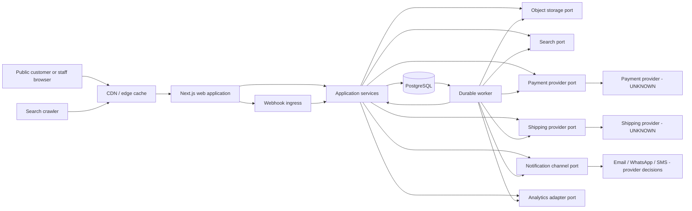
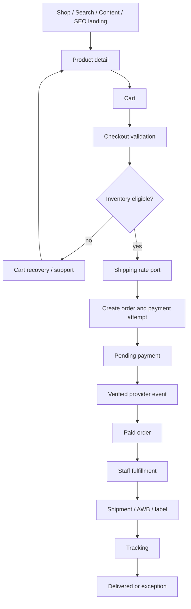
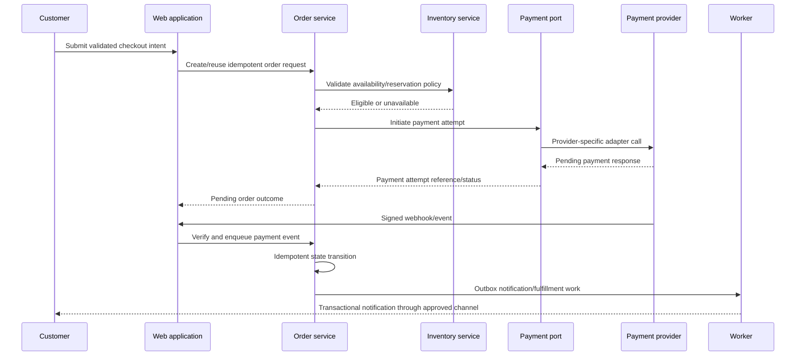
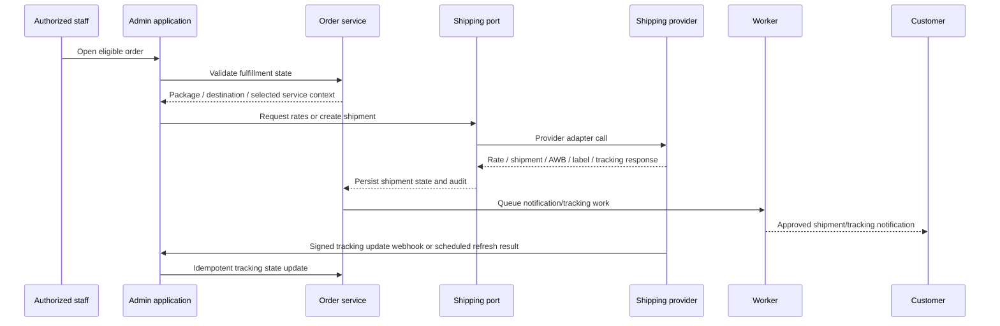
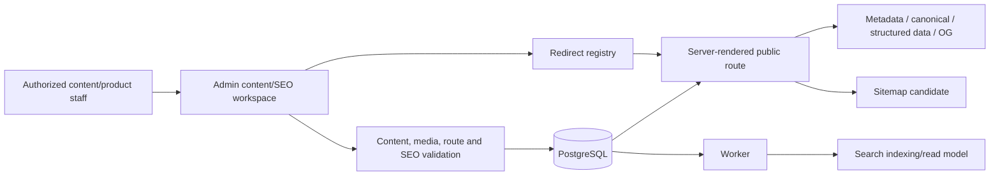
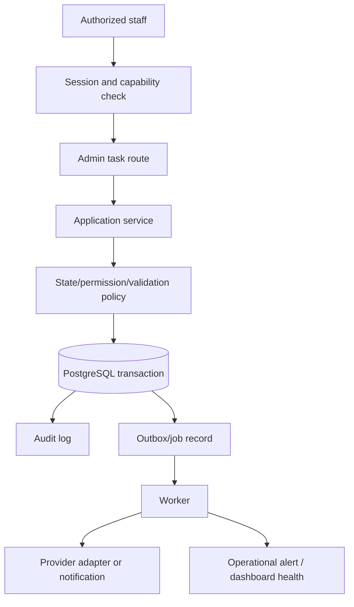

# PENA AMEEN System Architecture

**Phase:** 3 — Technical Architecture

**Status:** PROPOSED modular-monolith system blueprint. Payment and shipping are provider-agnostic by requirement; external-service providers remain unknown unless explicitly confirmed later.

## 1. System boundary

PENA AMEEN is one single-vendor digital-commerce system with three runtime responsibilities:

1. **Web application** — public SSR/SEO pages, customer/account routes, admin routes, APIs, and webhook ingress.
2. **Worker** — durable asynchronous work: notifications, search/media indexing, webhook follow-up, reconciliation, retries, and scheduled operational checks.
3. **Managed data/services** — PostgreSQL, object storage, and provider adapters behind application-owned ports.

The architecture is a modular monolith, not a microservice fleet. Domain modules communicate through in-process application services and durable outbox/job records where asynchronous reliability is required.

## 2. Major subsystems

| Subsystem | Responsibility | Owns | External boundary |
|---|---|---|---|
| Public web | Render Home, Shop, Education, content, branch, help, cart, checkout, tracking entry | Route rendering, response cache policy, public view models | Browser, crawler, CDN/cache |
| Catalog | Product/category/tag/attribute/media discovery | Product read model and catalog lifecycle | Media storage, search indexing |
| Inventory | Availability, reservations, adjustments, audit | Stock/availability decisions | Warehouse/operations data later |
| Cart and checkout | Customer purchase intent and validated checkout orchestration | Cart, checkout session, validation context | Payment/shipping ports |
| Order | Order lifecycle and immutable purchase snapshot | Orders, items, state transitions, audit/outbox | Payment/shipping/notification services |
| Payment | Provider-neutral payment attempts, events, refunds, reconciliation | Payment state mapping and provider adapter boundary | Payment provider UNKNOWN |
| Shipping | Provider-neutral rates, shipments, labels, AWB, tracking | Shipment/tracking state and provider adapter boundary | Shipping provider UNKNOWN |
| Customer/account | Guest/account ownership, addresses, order access | Customer profile/session authorization context | Authentication mechanism/provider deferred |
| Content and SEO | Articles/pages/taxonomy/media, metadata, redirects, sitemap, canonical decisions | Published content and SEO metadata | Crawler/Search Console later |
| Search | Public product/content discovery read model | Search queries, indexing triggers, relevance configuration | PostgreSQL search initially; external search optional |
| Notifications | Event-to-message orchestration, templates, delivery audit | Transactional notification records | Email/WhatsApp/SMS providers unknown |
| Admin | Staff operational commands/read models | Catalog, order, fulfillment, content/SEO workflows | Staff authorization and audit boundary |
| Analytics/observability | First-party domain events, metrics, audit, error/health signals | Event envelope and health read models | External analytics/monitoring optional |
| Media | Upload validation, object references, variants, rights metadata | Media lifecycle and content/product links | Object storage/CDN provider unknown |

## 3. High-level architecture diagram



## 4. Request and data flow

### Public/catalog request

```text
Browser or crawler
→ edge/cache decision
→ server-rendered route
→ catalog/content/SEO read service
→ PostgreSQL read model and media URLs
→ canonical HTML, metadata, structured data, response
```

Indexable routes render from server-owned data. Client-side enhancement must not be the only source of core product/content/SEO information.

### Commerce request

```text
Customer action
→ authenticated or guest context
→ request validation and idempotency boundary
→ application service transaction
→ order/cart/inventory updates
→ outbox record
→ response with truthful state
→ worker processes non-blocking follow-up
```

Provider calls that affect payment/shipping use explicit state transitions and durable records; the browser is never the authority for payment success.

## 5. Commerce flow



## 6. Checkout and payment flow



The exact reservation timing, payment method, provider response, expiration, refund, and settlement behavior remain client/provider decisions.

## 7. Shipping and fulfillment flow



Manual shipment/AWB/label fallback exists conceptually but must be authorized and audited. It is not a substitute for a provider decision.

## 8. Content and SEO flow



A published route change must be evaluated against the legacy URL mapping before it becomes public. Redirects, canonicals, and indexability are separate controls.

## 9. Admin operations flow



## 10. Authentication and authorization flow

- Browser requests resolve a session context on the server.
- Customer/private account routes require customer ownership checks.
- Staff/admin routes require a staff identity plus proposed role/capability permissions.
- Application services enforce authorization; route visibility alone is never authorization.
- Sensitive commands create audit entries and can require a future approval policy.
- Account/auth provider, password/recovery implementation, customer migration, and final staff role assignments remain unresolved.

## 11. Asynchronous processing and reliability

The web request persists business state and an outbox/job intent in the same database transaction where required. The worker processes jobs with retries, idempotency keys, attempt history, and dead-letter/manual-review state. This avoids relying on a browser request or a best-effort external call for payment events, shipment updates, notifications, indexing, or media processing.

A separate broker is deliberately deferred. A database-backed durable queue is the proposed MVP choice; throughput/reliability must be validated before production.

## 12. System-wide boundaries

| Boundary | Reason |
|---|---|
| Server-rendered public routes vs client enhancement | Protect SEO, performance, and accessibility while retaining interactive commerce behavior. |
| Application service vs route handler/server action | Keep business rules reusable, testable, and independent of HTTP/UI delivery. |
| Domain module vs repository/data access | Keep transaction rules and data persistence separate. |
| Provider port vs adapter | Prevent payment/shipping/notification/search/storage vendor coupling. |
| Request transaction vs worker job | Keep customer response truthful and fast while making retries/reconciliation durable. |
| Public/account/admin route spaces | Prevent private operational/customer state from entering crawlable public surfaces. |
| Authoritative commerce records vs analytics | Analytics observes events; order/payment/shipment records remain authoritative. |

## 13. Confirmed constraints and open blockers

**Confirmed:** single-vendor model; SEO-first public rendering; relational commerce needs; provider-agnostic payment/shipping; migration-sensitive URLs/content/media; complete commerce loop.

**Blocked/unknown:** catalog completeness, inventory rules, source SEO data, payment provider/methods, shipping provider/origin/rates, legal/privacy policy, account migration, historical orders, branch/event/media data, operational SOPs, hosting/provider selection.

Architecture can define ports and flows now, but provider-specific integration and migration execution remain blocked.
